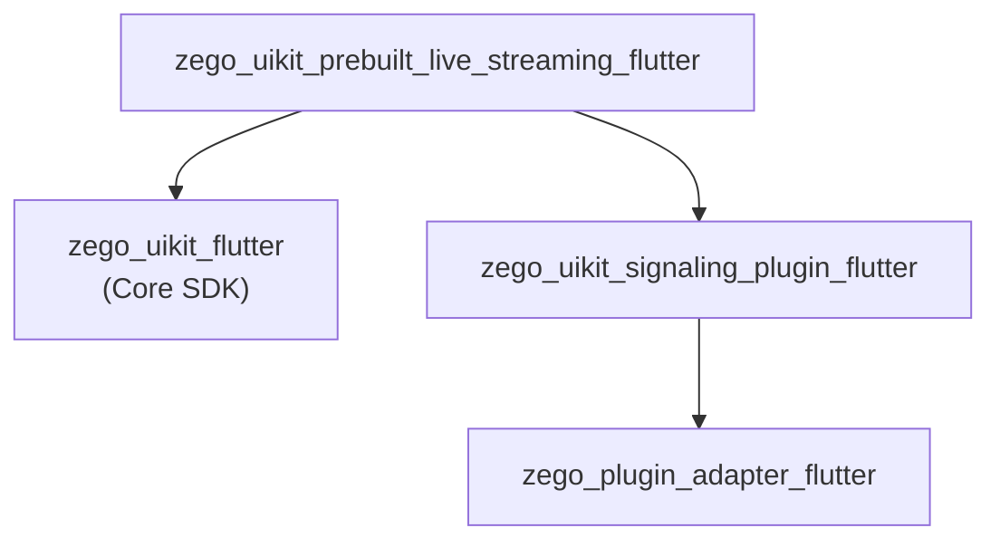

# ZegoUIKitPrebuiltLiveStreaming Architecture

> Live streaming SDK with host/audience roles, co-hosting, and PK

## Overview

`zego_uikit_prebuilt_live_streaming_flutter` is a **prebuilt UI SDK for live streaming scenarios**:

- **Role separation**: Host vs Audience
- **Co-hosting**: Audience can request to join as co-host
- **PK**: Two live rooms can interact
- **Swiping**: Audience can swipe to switch between live rooms

**Depends on**: `zego_uikit_flutter` (core SDK)

## Package Relationship



## Core Pattern: Role-Based Architecture

Unlike the Call package, Live Streaming has **role concepts**:

```
ZegoLiveStreamingRole
├── host      # Host, creates live room
├── coHost    # Co-host, participates in real-time interaction
└── audience  # Audience, watches without audio/video
```

## Quick Start

### Host View

```dart
import 'package:zego_uikit_prebuilt_live_streaming/zego_uikit_prebuilt_live_streaming.dart';

class LivePage extends StatelessWidget {
  @override
  Widget build(BuildContext context) {
    return ZegoUIKitPrebuiltLiveStreaming(
      appID: yourAppID,
      appSign: yourAppSign,
      userID: currentUserID,
      userName: currentUserName,
      liveID: 'live_room_001',  // Live room ID
      config: ZegoUIKitPrebuiltLiveStreamingConfig(
        role: ZegoLiveStreamingRole.host,  // Host role
      )..hostConfig(
        bottomMenuBar: ZegoLiveStreamingBottomMenuBarConfig(
          buttons: [
            ZegoLiveStreamingMenuBarButtonName.toggleMicrophone,
            ZegoLiveStreamingMenuBarButtonName.toggleCamera,
            ZegoLiveStreamingMenuBarButtonName.switchCamera,
            ZegoLiveStreamingMenuBarButtonName.requestCoHost,
          ],
        ),
      ),
    );
  }
}
```

### Audience View

```dart
ZegoUIKitPrebuiltLiveStreaming(
  appID: yourAppID,
  appSign: yourAppSign,
  userID: currentUserID,
  userName: currentUserName,
  liveID: 'live_room_001',
  config: ZegoUIKitPrebuiltLiveStreamingConfig(
    role: ZegoLiveStreamingRole.audience,  // Audience role
  )..audienceConfig(
    bottomMenuBar: ZegoLiveStreamingBottomMenuBarConfig(
      buttons: [
        ZegoLiveStreamingMenuBarButtonName.requestCoHost,
      ],
    ),
  )..swipingConfig = ZegoLiveStreamingSwipingConfig(
    isSwipingEnabled: true,  // Enable swipe to switch
  ),
)
```

## Configuration Pattern

### Host vs Audience Separate Config

```dart
ZegoUIKitPrebuiltLiveStreamingConfig config = ZegoUIKitPrebuiltLiveStreamingConfig(
  role: ZegoLiveStreamingRole.host,
  liveStreamingMode: ZegoLiveStreamingMode.liveStreaming,
)
  // Device state when joining
  ..turnOnCameraWhenJoining = true
  ..turnOnMicrophoneWhenJoining = false

  // Host config
  ..hostConfig(
    topMenuBar: ZegoLiveStreamingTopMenuBarConfig(
      title: 'My Live',
      showUserInviteButton: true,
    ),
    bottomMenuBar: ZegoLiveStreamingBottomMenuBarConfig(
      buttons: [...],
    ),
    audioVideoViewConfig: ZegoLiveStreamingAudioVideoViewConfig(
      showMicrophoneState: true,
      showCameraState: true,
    ),
  )

  // Audience config
  ..audienceConfig(
    bottomMenuBar: ZegoLiveStreamingBottomMenuBarConfig(
      buttons: [ZegoLiveStreamingMenuBarButtonName.requestCoHost],
    ),
  )

  // PK config
  ..pkConfig = ZegoLiveStreamingPKConfig(
    enablePK: true,
  )

  // Swiping config
  ..swipingConfig = ZegoLiveStreamingSwipingConfig(
    isSwipingEnabled: true,
  );
```

### Config Options

| Config | Description |
|--------|-------------|
| `role` | Role: host / coHost / audience |
| `liveStreamingMode` | Live streaming mode |
| `turnOnCameraWhenJoining` | Turn on camera when joining |
| `turnOnMicrophoneWhenJoining` | Turn on microphone when joining |
| `hostConfig` | Host-specific config |
| `audienceConfig` | Audience-specific config |
| `pkConfig` | PK feature config |
| `swipingConfig` | Swipe switching config |

## PK Feature (Cross-Room Interaction)

### Start PK

```dart
final controller = ZegoUIKitPrebuiltLiveStreamingController();

// Host starts PK
await controller.pk.startPK(targetLiveID: 'target_live_id');

// End PK
await controller.pk.endPK();
```

### PK Events

```dart
ZegoUIKitPrebuiltLiveStreamingEvents(
  onPKStarted: (ZegoPKInfo pkInfo) {
    print('PK started with ${pkInfo.targetLiveID}');
  },
  onPKEnded: (ZegoPKInfo pkInfo) {
    print('PK ended');
  },
  onPKUserJoined: (user, pkInfo) {
    print('${user.name} joined PK');
  },
  onPKUserLeft: (user, pkInfo) {
    print('${user.name} left PK');
  },
)
```

### PK Layout

When two live rooms PK, the layout is as follows:

```mermaid
+------------------+------------------+
|   Room A         |   Room B         |
|   (Host A)       |   (Host B)       |
|   [Users...]     |   [Users...]     |
|   coHost1        |   coHost1        |
|   coHost2        |   coHost2        |
+------------------+------------------+
|            PK Battle             |
+-----------------------------------+
```

## Co-Host Feature

### Audience View

```dart
final controller = ZegoUIKitPrebuiltLiveStreamingController();

// Request co-host
await controller.coHost.requestCoHost();

// Cancel request
await controller.coHost.cancelRequestCoHost();

// End co-host (become audience)
await controller.coHost.endCoHost();
```

### Host View

```dart
// Accept co-host request
await controller.coHost.acceptCoHostRequest(userID: 'userID');

// Reject co-host request
await controller.coHost.rejectCoHostRequest(userID: 'userID');

// End someone's co-host
await controller.coHost.endCoHost(userID: 'userID');

// End all co-hosts
await controller.coHost.endAllCoHost();
```

## Swiping (Swipe to Switch)

Audience can swipe left/right to switch between live rooms:

```dart
// Configure swiping
..swipingConfig = ZegoLiveStreamingSwipingConfig(
  isSwipingEnabled: true,
  liveIDsForSwiping: ['room_1', 'room_2', 'room_3'],
)

// Get current swiping state
final swipingService = ZegoUIKitPrebuiltLiveStreamingController().swiping;
bool isSwiping = swipingService.isSwiping;
String currentLiveID = swipingService.currentLiveID;
```

## Controller API

```dart
final controller = ZegoUIKitPrebuiltLiveStreamingController();

// Leave live streaming
await controller.leave();

// Minimize
controller.minimize.minimize(context);
controller.minimize.restore(context);

// Audio/video control
controller.audioVideo.muteMicrophone(true);
controller.audioVideo.muteCamera(true);

// User management
final users = controller.user.getAllUsers();
final speakers = controller.user.getSpeakers();

// Message
controller.message.send('Hello everyone!');
```

## Events

```dart
ZegoUIKitPrebuiltLiveStreamingEvents(
  // Room events
  onUserJoin: (user) {},
  onUserLeave: (user) {},
  onLiveStreamingEnded: (reason) {},

  // Co-host events
  onCoHostRequestReceived: (user) {},
  onCoHostRequestAccepted: () {},
  onCoHostRequestRejected: () {},
  onCoHostJoined: (user) {},
  onCoHostLeft: (user) {},

  // PK events
  onPKStarted: (pkInfo) {},
  onPKEnded: (pkInfo) {},
  onPKUserJoined: (user, pkInfo) {},
  onPKUserLeft: (user, pkInfo) {},

  // Message
  onReceiveCustomCommand: (fromUser, command) {},

  // Error
  onError: (errorCode, errorMessage) {},
)
```

## Directory Structure

```
lib/src/
├── live_streaming.dart         # Main entry Widget
├── controller.dart             # Controller singleton
├── config.dart                 # ZegoUIKitPrebuiltLiveStreamingConfig
├── events.dart                 # Events
├── defines.dart               # Public defines
├── config.defines.dart        # Config-related defines
├── events.defines.dart
├── inner_text.dart
├── components/                 # UI components
│   ├── live_streaming.dart     # Component exports
│   ├── top_bar.dart
│   ├── bottom_bar.dart
│   ├── member/
│   ├── message/
│   └── ...
├── controller/                # Controller mixins
│   ├── audio_video.dart        # Audio/video control
│   ├── co.host.dart            # Co-host control
│   ├── minimize.dart           # Minimize
│   ├── pip.dart                # PiP
│   ├── pk.dart                 # PK control
│   ├── room.dart               # Room operations
│   ├── screen.dart             # Screen sharing
│   ├── swiping.dart            # Swipe control
│   ├── user.dart               # User operations
│   ├── media.dart              # Media control
│   ├── message.dart            # Message
│   ├── log.dart
│   └── private/
├── pk/                        # PK core implementation
│   ├── config.dart
│   ├── core/
│   └── layout/
├── swiping/                   # Swipe switching
│   ├── config.dart
│   ├── page.dart
│   └── ...
├── minimizing/
├── internal/
└── modules/
```

## Key Differences from Call SDK

| Aspect | Live Streaming | Call SDK |
|--------|---------------|----------|
| Role Model | Role separation (host/co-host/audience) | Peer-to-peer |
| PK | Supported | Not supported |
| Swiping | Audience can swipe to switch | Not supported |
| Invite | No call invitation | Call invitation system |
| Minimizing | Live minimizing | Call minimizing |

## Dependency Packages

Core dependencies:
- `zego_uikit` - Core SDK
- `zego_plugin_adapter` - Plugin adapter
- `zego_uikit_signaling_plugin` - Signaling plugin
- `floating` - Android floating
- `permission_handler` - Permission management

## Related Documentation

- [ZegoUIKit Architecture](../zego_uikit_flutter/ARCHITECTURE.md)
- [ZegoUIKitPrebuiltCall Architecture](../zego_uikit_prebuilt_call_flutter/ARCHITECTURE.md)
