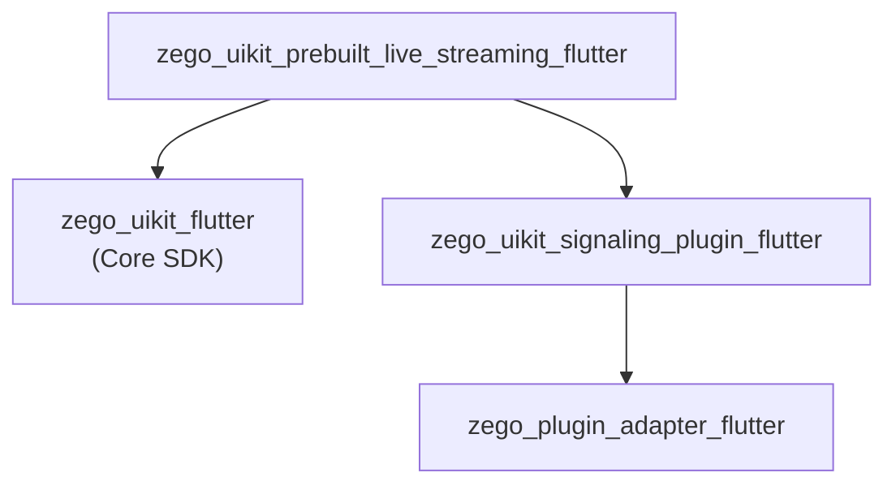

# ZegoUIKitPrebuiltLiveStreaming Architecture

> 直播 SDK，支持主播/观众角色、连麦、PK

## Overview

`zego_uikit_prebuilt_live_streaming_flutter` 是**直播场景的预构建 UI SDK**：

- **角色分离**: 主播(Host) vs 观众(Audience)
- **连麦**: 观众申请上麦成为连麦者(Co-host)
- **PK**: 两个直播间互通
- **滑屏切换**: 观众可滑动画布切换直播间

**依赖**: `zego_uikit_flutter` (核心SDK)

## Package Relationship



## Core Pattern: Role-Based Architecture

与 Call 包不同，Live Streaming 有**角色概念**：

```
ZegoLiveStreamingRole
├── host      # 主播，创建直播间
├── coHost    # 连麦者，实时参与互动
└── audience  # 观众，观看但不参与音视频
```

## Quick Start

### 主播视角

```dart
import 'package:zego_uikit_prebuilt_live_streaming/zego_uikit_prebuilt_live_streaming.dart';

class LivePage extends StatelessWidget {
  @override
  Widget build(BuildContext context) {
    return ZegoUIKitPrebuiltLiveStreaming(
      appID: yourAppID,
      appSign: yourAppSign,
      userID: currentUserID,
      userName: currentUserName,
      liveID: 'live_room_001',  // 直播间ID
      config: ZegoUIKitPrebuiltLiveStreamingConfig(
        role: ZegoLiveStreamingRole.host,  // 主播角色
      )..hostConfig(
        bottomMenuBar: ZegoLiveStreamingBottomMenuBarConfig(
          buttons: [
            ZegoLiveStreamingMenuBarButtonName.toggleMicrophone,
            ZegoLiveStreamingMenuBarButtonName.toggleCamera,
            ZegoLiveStreamingMenuBarButtonName.switchCamera,
            ZegoLiveStreamingMenuBarButtonName.requestCoHost,
          ],
        ),
      ),
    );
  }
}
```

### 观众视角

```dart
ZegoUIKitPrebuiltLiveStreaming(
  appID: yourAppID,
  appSign: yourAppSign,
  userID: currentUserID,
  userName: currentUserName,
  liveID: 'live_room_001',
  config: ZegoUIKitPrebuiltLiveStreamingConfig(
    role: ZegoLiveStreamingRole.audience,  // 观众角色
  )..audienceConfig(
    bottomMenuBar: ZegoLiveStreamingBottomMenuBarConfig(
      buttons: [
        ZegoLiveStreamingMenuBarButtonName.requestCoHost,
      ],
    ),
  )..swipingConfig = ZegoLiveStreamingSwipingConfig(
    isSwipingEnabled: true,  // 启用滑屏切换
  ),
)
```

## Configuration Pattern

### Host vs Audience 分别配置

```dart
ZegoUIKitPrebuiltLiveStreamingConfig config = ZegoUIKitPrebuiltLiveStreamingConfig(
  role: ZegoLiveStreamingRole.host,
  liveStreamingMode: ZegoLiveStreamingMode.liveStreaming,
)
  // 入会时设备状态
  ..turnOnCameraWhenJoining = true
  ..turnOnMicrophoneWhenJoining = false

  // 主播配置
  ..hostConfig(
    topMenuBar: ZegoLiveStreamingTopMenuBarConfig(
      title: 'My Live',
      showUserInviteButton: true,
    ),
    bottomMenuBar: ZegoLiveStreamingBottomMenuBarConfig(
      buttons: [...],
    ),
    audioVideoViewConfig: ZegoLiveStreamingAudioVideoViewConfig(
      showMicrophoneState: true,
      showCameraState: true,
    ),
  )

  // 观众配置
  ..audienceConfig(
    bottomMenuBar: ZegoLiveStreamingBottomMenuBarConfig(
      buttons: [ZegoLiveStreamingMenuBarButtonName.requestCoHost],
    ),
  )

  // PK 配置
  ..pkConfig = ZegoLiveStreamingPKConfig(
    enablePK: true,
  )

  // 滑屏配置
  ..swipingConfig = ZegoLiveStreamingSwipingConfig(
    isSwipingEnabled: true,
  );
```

### 配置选项表

| 配置项 | 说明 |
|--------|------|
| `role` | 角色：host / coHost / audience |
| `liveStreamingMode` | 直播模式 |
| `turnOnCameraWhenJoining` | 入会时开启摄像头 |
| `turnOnMicrophoneWhenJoining` | 入会时开启麦克风 |
| `hostConfig` | 主播专属配置 |
| `audienceConfig` | 观众专属配置 |
| `pkConfig` | PK 功能配置 |
| `swipingConfig` | 滑屏切换配置 |

## PK Feature (跨直播间互动)

### 发起 PK

```dart
final controller = ZegoUIKitPrebuiltLiveStreamingController();

// 主播发起 PK
await controller.pk.startPK(targetLiveID: 'target_live_id');

// 结束 PK
await controller.pk.endPK();
```

### PK 监听

```dart
ZegoUIKitPrebuiltLiveStreamingEvents(
  onPKStarted: (ZegoPKInfo pkInfo) {
    print('PK started with ${pkInfo.targetLiveID}');
  },
  onPKEnded: (ZegoPKInfo pkInfo) {
    print('PK ended');
  },
  onPKUserJoined: (user, pkInfo) {
    print('${user.name} joined PK');
  },
  onPKUserLeft: (user, pkInfo) {
    print('${user.name} left PK');
  },
)
```

### PK 布局

当两个直播间 PK 时，布局如下：

```mermaid
+------------------+------------------+
|   Room A         |   Room B         |
|   (Host A)       |   (Host B)       |
|   [Users...]     |   [Users...]     |
|   coHost1        |   coHost1        |
|   coHost2        |   coHost2        |
+------------------+------------------+
|            PK Battle             |
+-----------------------------------+
```

## Co-Host Feature (连麦)

### 观众视角

```dart
final controller = ZegoUIKitPrebuiltLiveStreamingController();

// 申请连麦
await controller.coHost.requestCoHost();

// 取消申请
await controller.coHost.cancelRequestCoHost();

// 结束连麦（成为观众）
await controller.coHost.endCoHost();
```

### 主播视角

```dart
// 同意连麦申请
await controller.coHost.acceptCoHostRequest(userID: 'userID');

// 拒绝连麦申请
await controller.coHost.rejectCoHostRequest(userID: 'userID');

// 结束某个连麦者的连麦
await controller.coHost.endCoHost(userID: 'userID');

// 结束所有连麦
await controller.coHost.endAllCoHost();
```

### 连麦监听

```dart
ZegoUIKitPrebuiltLiveStreamingEvents(
  onCoHostRequestReceived: (user) {
    // 收到连麦申请（主播）
    print('${user.name} wants to co-host');
  },
  onCoHostRequestAccepted: () {
    // 申请被接受（观众）
    print('Your co-host request was accepted');
  },
  onCoHostRequestRejected: () {
    // 申请被拒绝（观众）
    print('Your co-host request was rejected');
  },
  onCoHostJoined: (user) {
    print('${user.name} joined as co-host');
  },
  onCoHostLeft: (user) {
    print('${user.name} left co-host');
  },
)
```

## Swiping (滑屏切换)

观众可以左右滑动切换直播间：

```dart
// 配置滑屏
..swipingConfig = ZegoLiveStreamingSwipingConfig(
  isSwipingEnabled: true,
  liveIDsForSwiping: ['room_1', 'room_2', 'room_3'],
)

// 获取当前滑屏状态
final swipingService = ZegoUIKitPrebuiltLiveStreamingController().swiping;
bool isSwiping = swipingService.isSwiping;
String currentLiveID = swipingService.currentLiveID;
```

## Controller API

```dart
final controller = ZegoUIKitPrebuiltLiveStreamingController();

// 离开直播
await controller.leave();

// 最小化
controller.minimize.minimize(context);
controller.minimize.restore(context);

// 音视频控制
controller.audioVideo.muteMicrophone(true);
controller.audioVideo.muteCamera(true);

// 用户管理
final users = controller.user.getAllUsers();
final speakers = controller.user.getSpeakers();

// 消息
controller.message.send('Hello everyone!');
```

## Events

```dart
ZegoUIKitPrebuiltLiveStreamingEvents(
  // 房间事件
  onUserJoin: (user) {},
  onUserLeave: (user) {},
  onLiveStreamingEnded: (reason) {},

  // 连麦事件
  onCoHostRequestReceived: (user) {},
  onCoHostRequestAccepted: () {},
  onCoHostRequestRejected: () {},
  onCoHostJoined: (user) {},
  onCoHostLeft: (user) {},

  // PK 事件
  onPKStarted: (pkInfo) {},
  onPKEnded: (pkInfo) {},
  onPKUserJoined: (user, pkInfo) {},
  onPKUserLeft: (user, pkInfo) {},

  // 消息
  onReceiveCustomCommand: (fromUser, command) {},

  // 错误
  onError: (errorCode, errorMessage) {},
)
```

## Directory Structure

```
lib/src/
├── live_streaming.dart         # 主入口 Widget
├── controller.dart             # Controller 单例
├── config.dart                 # ZegoUIKitPrebuiltLiveStreamingConfig
├── events.dart                 # Events
├── defines.dart               # 公共定义
├── config.defines.dart        # 配置相关定义
├── events.defines.dart
├── inner_text.dart
├── components/                 # UI 组件
│   ├── live_streaming.dart     # 组件导出
│   ├── top_bar.dart
│   ├── bottom_bar.dart
│   ├── member/
│   ├── message/
│   └── ...
├── controller/                # Controller mixins
│   ├── audio_video.dart        # 音视频控制
│   ├── co.host.dart            # 连麦控制
│   ├── minimize.dart           # 最小化
│   ├── pip.dart                # PiP
│   ├── pk.dart                 # PK 控制
│   ├── room.dart               # 房间操作
│   ├── screen.dart             # 屏幕共享
│   ├── swiping.dart            # 滑屏控制
│   ├── user.dart               # 用户操作
│   ├── media.dart              # 媒体控制
│   ├── message.dart            # 消息
│   ├── log.dart
│   └── private/
├── pk/                        # PK 核心实现
│   ├── config.dart
│   ├── core/
│   └── layout/
├── swiping/                   # 滑屏切换
│   ├── config.dart
│   ├── page.dart
│   └── ...
├── minimizing/
├── internal/
└── modules/
```

## Key Differences from Call SDK

| Aspect | Live Streaming | Call SDK |
|--------|---------------|----------|
| Role Model | 角色分离 (host/co-host/audience) | 对等 (peer-to-peer) |
| PK | 支持 | 不支持 |
| Swiping | 支持观众滑屏切换 | 不支持 |
| Invite | 无通话邀请 | 通话邀请系统 |
| Minimizing | 直播最小化 | 通话最小化 |

## Dependency Packages

核心依赖：
- `zego_uikit` - 核心 SDK
- `zego_plugin_adapter` - 插件适配
- `zego_uikit_signaling_plugin` - 信令插件
- `floating` - Android 悬浮窗
- `permission_handler` - 权限管理

## Related Documentation

- [ZegoUIKit Architecture](../zego_uikit_flutter/ARCHITECTURE.md)
- [ZegoUIKitPrebuiltCall Architecture](../zego_uikit_prebuilt_call_flutter/ARCHITECTURE.md)