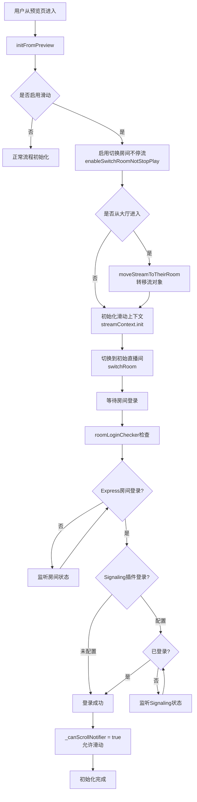
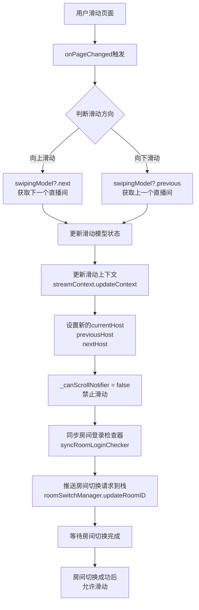
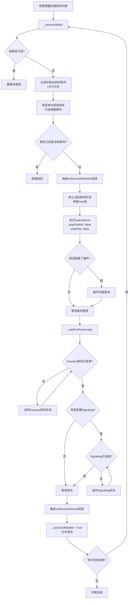
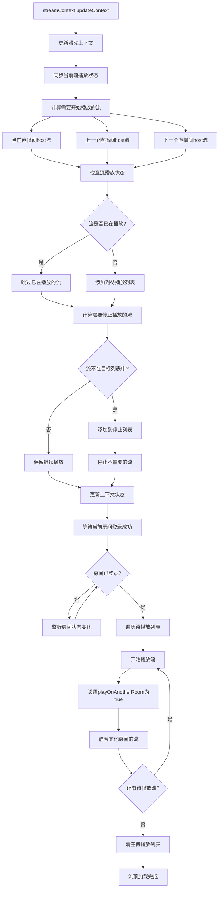

# 直播滑动优化技术方案文档

## 一、旧版本限制与问题分析

### 1.1 版本对比

**版本对比：**

- 旧版本：`zego_uikit-2.28.34` / `zego_uikit_prebuilt_live_streaming-3.15.3`
- 新版本：当前开发版本

### 1.2 旧版本的核心限制

旧版本在架构设计上存在以下限制，导致无法支持流畅的直播滑动功能：

#### 1.2.1 单房间数据管理限制

**问题描述：**

- 底层只支持单房间数据管理，无法同时维护多个房间的数据
- 房间、流、用户、消息等数据都是全局单例，按房间ID隔离不够彻底
- 切换房间时需要完全清理旧房间数据，导致流的texture被销毁

**影响：**

- 每次切换房间都需要重新拉流和构建texture
- 切换过程有明显延迟和黑屏现象
- 无法提前预加载相邻直播间的流

#### 1.2.2 页面生命周期强耦合问题

**问题描述：**

- `ZegoLiveStreamingPage` 的 `initState` 和 `dispose` 与房间的创建/加入、离开/销毁流程强耦合
- 页面创建时执行 `createEngine`、`joinRoom` 等操作
- 页面销毁时执行 `leaveRoom`、`uninitEngine` 等操作
- 滑动场景下，页面频繁创建和销毁，导致房间频繁进出

**影响：**

- 滑动切换直播间时，每次都需要完整的房间登录/登出流程，耗时过长
- 无法实现快速的房间切换
- 房间状态与页面生命周期绑定，难以管理多个房间

#### 1.2.3 流对象重建问题

**问题描述：**

- 切换房间时必须先停止所有流，然后离开房间，再进入新房间，最后重新拉流
- 流的texture对象无法跨房间复用，每次都需要重新构建
- 没有流的"转移"机制，无法将流对象直接转移到另一个房间

**影响：**

- 切换房间时出现明显的视频中断
- 流的重新加载导致延迟增加
- 界面渲染不流畅，用户体验差

#### 1.2.4 路由管理问题

**问题描述：**

- 从大厅进入直播间，或从直播间返回大厅，使用 `Navigator.push` 等标准路由
- SDK的路由操作会影响应用自身的路由栈
- 滑动场景下路由管理混乱，容易出现返回键行为异常

**影响：**

- 影响应用的导航栈管理
- 返回键行为不符合预期
- 无法与应用的现有路由系统良好集成

#### 1.2.5 房间切换机制问题

**问题描述：**

- 切换房间使用 `logoutRoom` + `loginRoom` 的方式
- 需要完全退出旧房间，再进入新房间
- 没有 `switchRoom` 这样的快速切换机制
- 切换过程中流必须停止，无法保持流的连续性

**影响：**

- 房间切换耗时过长
- 快速滑动时容易导致房间状态不一致
- 切换过程中出现视频中断和黑屏

### 1.3 为什么旧版本无法支持流畅滑动

基于以上限制，旧版本无法支持流畅的直播滑动，主要原因如下：

1. **数据管理限制**：单房间数据管理导致无法同时维护多个房间的流数据
2. **生命周期耦合**：页面生命周期与房间操作强耦合，无法实现快速切换
3. **流重建成本**：每次切换都需要重建流的texture，成本高
4. **路由干扰**：路由管理会影响应用的导航栈
5. **切换机制低效**：logout/login 方式切换慢，无法满足滑动场景的快速切换需求

### 1.4 新版本的解决方案概述

针对以上问题，新版本进行了全面的架构优化：

1. **多房间数据支持**：底层支持多房间数据管理，可以同时维护多个房间的数据
2. **生命周期解耦**：通过 `ZegoLiveStreamingPageLifeCycle` 封装页面生命周期逻辑，分离正常直播间和滑动直播间两套流程
3. **流对象优化**：支持流的直接转移（`transferToAnotherRoom`），避免重建
4. **路由优化**：使用 `pushReplacement` 确保不影响应用路由
5. **快速切换机制**：使用 `switchRoom` 实现快速房间切换，避免 logout/login 的耗时

## 二、概述

本文档详细记录了直播滑动优化方案的技术实现，包括底层 `zego_uikit` 多房间数据支持的实现，以及 `zego_uikit_prebuilt_live_streaming` 新滑动方案的流程和注意事项。

## 二、底层多房间支持（zego_uikit）

### 2.1 架构设计

#### 2.1.1 多房间数据结构

底层采用 **`ZegoUIKitCoreRoomMap<T>`** 作为多房间数据管理的基础结构，实现了以房间ID为键的数据存储和管理。

```dart
class ZegoUIKitCoreRoomMap<T extends Object> {
  final Map<String, T> _innerRoomMap = {};
  final T Function(String roomID) createDefault;
  // ...
}
```

**核心特性：**

- 支持按房间ID动态创建和管理数据对象
- 提供空房间（empty room）预创建机制，支持房间ID的"升级"（upgrade）
- 线程安全的并发访问控制（使用 `synchronized` 锁）
- 支持同步和异步遍历所有房间数据

#### 2.1.2 多房间数据分类

底层通过 `ZegoUIKitCoreData` 统一管理所有房间数据，采用模块化设计：

```dart
// lib/src/services/core/data/data.dart
class ZegoUIKitCoreData {
  final message = ZegoUIKitCoreDataMessage();
  final room = ZegoUIKitCoreDataRoom();
  final stream = ZegoUIKitCoreDataStream();
  final user = ZegoUIKitCoreDataUser();
  // ... 其他模块
}
```

每个模块都使用 `ZegoUIKitCoreRoomMap` 实现多房间数据管理：

**1. 房间信息（Room）**

- 位置：`lib/src/services/core/data/room.dart`
- 数据结构：`ZegoUIKitCoreDataRoom`
- 存储方式：`ZegoUIKitCoreRoomMap<ZegoUIKitCoreDataSingleRoom>`
- 功能：管理每个房间的登录状态、房间属性等

**2. 流信息（Stream）**

- 位置：`lib/src/services/core/data/stream.dart`
- 数据结构：`ZegoUIKitCoreDataStream`
- 存储方式：`ZegoUIKitCoreRoomMap<ZegoUIKitCoreDataRoomStream>`
- 功能：管理每个房间的推拉流、texture对象等

**3. 用户信息（User）**

- 位置：`lib/src/services/core/data/user.dart`
- 数据结构：`ZegoUIKitCoreDataUser`
- 存储方式：`ZegoUIKitCoreRoomMap<ZegoUIKitCoreDataRoomUser>`
- 功能：管理每个房间的用户列表、用户状态等

**4. 消息信息（Message）**

- 位置：`lib/src/services/core/data/message.dart`
- 数据结构：`ZegoUIKitCoreDataMessage`
- 存储方式：`ZegoUIKitCoreRoomMap<ZegoUIKitCoreDataRoomMessage>`
- 功能：管理每个房间的聊天消息、系统通知等

**数据隔离机制：**

- 每个房间的数据通过房间ID进行隔离
- 不同房间的数据互不影响，可以同时存在
- 支持按房间ID独立访问和清理数据

### 2.2 核心API

#### 2.2.1 房间切换API

**`switchRoom` - 切换房间**

```dart
Future<void> switchRoom({
  required String toRoomID,
  required bool stopPublishAllStream,
  required bool stopPlayAllStream,
  String token = '',
})
```

**关键实现：**

- 位置：`lib/src/services/core/data/room.dart` 的 `switchTo` 方法
- 功能：从当前房间切换到目标房间
- 支持选择是否停止推流和拉流，为滑动优化提供灵活性

**注意事项：**

- 切换房间时，旧房间数据不会被立即清除（避免滑动时重新拉流构建texture）
- 仅标记房间状态变更，不执行完整的数据清理

#### 2.2.2 切换房间不停流API

**`enableSwitchRoomNotStopPlay` - 启用切换房间时不停流**

```dart
Future<void> enableSwitchRoomNotStopPlay(bool enabled) async {
  coreData.stream.isEnableSwitchRoomNotStopPlay = enabled;
  await ZegoUIKit().setAdvanceConfigs({
    'switch_room_not_stop_play': enabled ? 'true' : 'false',
  });
}
```

**作用：**

- 设置后，调用 `switchRoom` 时不会停止拉流（RTC流和CDN流都不会停止）
- 这是滑动优化的核心配置，确保滑动切换时视频流的连续性

**位置：**

- 实现：`lib/src/services/core/core.dart` 第664行
- 配置项：`isEnableSwitchRoomNotStopPlay`（`lib/src/services/core/data/stream.dart` 第31行）

#### 2.2.3 跨房间播放流API

**`startPlayAnotherRoomAudioVideo` - 开始播放其他房间的音视频**

```dart
Future<void> startPlayAnotherRoomAudioVideo({
  required String targetRoomID,
  required String anotherRoomID,
  required String anotherUserID,
  String? anotherUserName,
  bool playOnAnotherRoom = false,
})
```

**`stopPlayAnotherRoomAudioVideo` - 停止播放其他房间的音视频**

```dart
Future<void> stopPlayAnotherRoomAudioVideo({
  required String targetRoomID,
  required String anotherUserID,
})
```

**用途：**

- 支持在当前房间播放其他房间的流
- 用于滑动场景：提前预加载相邻直播间的流，实现流畅切换
- 可设置 `playOnAnotherRoom=true`，在其他房间页面渲染

**位置：**

- 实现：`lib/src/services/mixer_service.dart`

#### 2.2.5 流对象转移优化

**`transferToAnotherRoom` - 将流对象转移到另一个房间**

流对象优化是新版本的重要改进，支持将已创建的流对象直接转移到目标房间，避免重新构建texture。

**核心优势：**

- 流的texture对象可以在房间间转移，无需重建
- 减少流的重新加载时间，提升切换流畅度
- 保持视频渲染的连续性，避免黑屏

**实现原理：**

- 流的texture对象与房间解耦
- 切换房间时，将流的上下文信息转移到目标房间
- 保持流的播放状态，仅更新房间关联关系

**使用场景：**

- 滑动切换直播间时，可以保留当前流的texture
- 从大厅进入直播间时，可以转移大厅中的流对象
- 实现流的无缝切换，提升用户体验

#### 2.2.4 房间状态管理API

**`getRoomsStateStream` - 获取所有房间状态流**

```dart
ValueNotifier<Map<String, ZegoUIKitRoomState>> getRoomsStateStream() {
  return ZegoUIKitCore.shared.coreData.room.roomsStateNotifier;
}
```

**作用：**

- 返回所有房间的状态映射（房间ID -> 房间状态）
- 支持监听多房间状态变化
- 用于滑动场景：判断目标房间是否已登录，决定是否可以开始播放流

**位置：**

- 实现：`lib/src/services/room_service.dart` 第201行

**`getRoomStateStream` - 获取指定房间状态流**

```dart
ValueNotifier<ZegoUIKitRoomState> getRoomStateStream({
  required String targetRoomID,
})
```

### 2.3 数据生命周期管理

#### 2.3.1 房间数据创建

当需要访问某个房间的数据时，系统会自动创建：

```dart
T getRoom(String roomID) {
  if (_innerRoomMap.containsKey(roomID)) {
    return _innerRoomMap[roomID]!;
  }
  // 自动创建房间数据
  _innerRoomMap[roomID] = createDefault(roomID);
  return _innerRoomMap[roomID]!;
}
```

#### 2.3.2 房间数据清理

**按房间清理：**

```dart
void clear({
  required String targetRoomID,
  required bool stopPublishAllStream,
  required bool stopPlayAllStream,
})
```

**全部清理：**

```dart
Future<void> uninit() async {
  await rooms.forEachAsync((roomID, roomInfo) async {
    await roomInfo.leave();
    roomInfo.uninit();
  });
}
```

#### 2.3.3 空房间升级机制

系统支持"空房间"（empty room）的预创建和升级：

```dart
onUpgradeEmptyRoom: (ZegoUIKitCoreDataSingleRoom emptyRoom, roomID) {
  // 当预创建的房间被分配真实房间ID时，更新其roomID
  emptyRoom.id = roomID;
}
```

**优势：**

- 允许在房间ID未知时预先创建房间对象
- 当房间ID确定后，自动升级，保留之前设置的监听器等状态

## 三、直播新滑动方案（zego_uikit_prebuilt_live_streaming）

### 3.1 整体架构

新滑动方案采用 **PageView + 房间切换管理** 的架构，实现流畅的上下滑动切换直播间体验。

#### 3.1.1 核心组件

**1. `ZegoLiveStreamingSwipingPage` - 滑动页面容器**

- 位置：`lib/src/modules/swiping/page.dart`
- 功能：使用 `LoopPageView` 实现无限循环滑动
- 管理3个页面：上一个、当前、下一个直播间

**2. `LiveStreamingSwipingStreamContext` - 滑动流上下文**

- 位置：`lib/src/lifecycle/swiping/stream_context.dart`
- 功能：管理当前、上一个、下一个直播间的流信息
- 负责流的预加载和释放
- 与 `ZegoUIKitHallRoomListController` 配合，实现流对象的直接转移

**3. `ZegoLiveStreamingSwipingPageRoomSwitcher` - 房间切换管理器**

- 位置：`lib/src/lifecycle/swiping/page_room_switcher.dart`
- 功能：使用栈（LIFO）管理房间切换流程
- 确保房间登录成功后才允许继续滑动
- 使用 `switchRoom` API 避免 logout/login 的耗时操作

**4. `ZegoLiveStreamingRoomLoginChecker` - 房间登录检查器**

- 位置：`lib/src/lifecycle/swiping/room_login_checker.dart`
- 功能：检查房间登录状态（Express + Signaling）
- 控制滑动启用时机

**5. `ZegoLiveStreamingPageLifeCycle` - 生命周期管理器**

- 位置：`lib/src/lifecycle/lifecycle.dart`
- 功能：封装页面生命周期逻辑，分离正常直播间和滑动直播间两套流程
- 解决页面 initState/dispose 与房间操作的强耦合问题

#### 3.1.2 生命周期解耦设计

**问题背景：**

原来的设计将 `createEngine`、`joinRoom` 等操作放在页面的 `initState` 中，将 `leaveRoom`、`uninitEngine` 等操作放在 `dispose` 中。这导致滑动场景下，页面频繁创建和销毁时，房间也会频繁进出。

**解决方案：**

通过 `ZegoLiveStreamingPageLifeCycle` 封装生命周期逻辑，提供两套流程：

**1. 正常直播间流程（normal）**

- 位置：`lib/src/lifecycle/normal/`
- 使用场景：单个直播间，正常的进入和退出
- 流程：页面创建 → 创建引擎 → 加入房间 → ... → 页面销毁 → 离开房间 → 销毁引擎

**2. 滑动直播间流程（swiping）**

- 位置：`lib/src/lifecycle/swiping/`
- 使用场景：滑动切换直播间
- 流程：统一的生命周期管理，页面创建/销毁不触发房间操作，通过 `switchRoom` 切换房间

**关键实现：**

```dart
// lib/src/lifecycle/lifecycle.dart
class ZegoLiveStreamingPageLifeCycle {
  final swiping = ZegoLiveStreamingSwipingLifeCycle();
  final normal = ZegoLiveStreamingNormalLifeCycle();

  // 从预览页初始化
  Future<void> initFromPreview({...}) async {
    // 初始化滑动相关逻辑
    swiping.initFromPreview(...);
    // 初始化正常直播相关逻辑
    normal.initFromPreview(...);
  }

  // 页面 initState 时的处理
  bool initFromLive({...}) {
    if (swiping.usingRoomSwiping) {
      // 滑动场景：等待页面构建器驱动房间切换
      return false;
    } else {
      // 正常场景：执行正常的房间加入流程
      normal.initStateDelegate.initFromLive(...);
      return true;
    }
  }
}
```

#### 3.1.3 路由管理优化

**使用 pushReplacement 避免路由干扰**

**问题：**

- 使用标准的 `Navigator.push` 会增加路由栈深度
- SDK 的路由操作会影响应用的路由管理
- 滑动场景下路由栈会变得复杂

**解决方案：**

- 从大厅进入直播间：使用 `Navigator.pushReplacement` 替换大厅页面
- 从直播间返回大厅：使用 `Navigator.pushReplacement` 替换直播间页面
- 确保路由栈深度保持稳定，不影响应用的路由管理

**实现位置：**

- `lib/src/modules/hall/list.dart` 第292行
- 使用 `pushReplacement` 在 `ZegoUIKitLiveStreamingHallList` 和 `ZegoUIKitPrebuiltLiveStreaming` 之间切换

**优势：**

- 不影响应用的导航栈
- 返回键行为符合预期
- 路由管理清晰，易于维护

### 3.2 滑动流程

#### 3.2.1 初始化流程



**关键代码：**

```dart
// lib/src/lifecycle/swiping/swiping.dart
Future<void> initFromPreview({...}) async {
  // 启用切换房间不停流
  await ZegoUIKit().enableSwitchRoomNotStopPlay(true);
  
  // 初始化滑动上下文
  await streamContext.init(token: token, swipingConfig: swipingConfig);
  
  // 如果从大厅进入，切换到直播间
  if (isPrebuiltFromHall) {
    await ZegoUIKit().switchRoom(
      toRoomID: liveID,
      stopPublishAllStream: false,
      stopPlayAllStream: false,
    );
  }
}
```

#### 3.2.2 滑动切换流程



#### 3.2.3 房间切换执行流程



#### 3.2.4 流预加载流程



**关键代码：**

```dart
// lib/src/lifecycle/swiping/stream_context.dart
Future<void> tryPlayPendingHost() async {
  // 等待当前房间登录成功
  final roomState = roomsState[currentSwipingHost.roomID]!;
  if (!roomState.isLogin2) {
    return; // 继续等待
  }

  // 开始播放其他房间的流
  for (var host in pendingPlayHosts) {
    await ZegoUIKit().startPlayAnotherRoomAudioVideo(
      targetRoomID: currentSwipingHost.roomID,
      anotherRoomID: host.roomID,
      anotherUserID: host.user.id,
      anotherUserName: host.user.name,
      playOnAnotherRoom: true, // 在其他房间页面渲染
    );

    // 静音其他房间的流
    await ZegoUIKit().muteUserAudio(
      host.user.id,
      true,
      targetRoomID: host.roomID,
    );
  }
}
```

#### 3.2.5 流对象转移机制

**从大厅到直播间的流转移：**

当从大厅进入直播间时，使用 `moveStreamToTheirRoom()` 将大厅中已加载的流对象直接转移到对应的直播间，避免重新拉流。

**实现原理：**

1. 大厅页面预加载了各个直播间的host流
2. 用户点击进入某个直播间时，该流已经在大厅中播放
3. 使用流转移机制，将流对象从大厅房间转移到目标直播间
4. 流的texture对象保持不变，实现无缝切换

**优势：**

- 避免重新拉流，减少切换时间
- 保持视频流的连续性
- 提升用户体验，实现真正的无缝切换

**配合组件：**

- `ZegoUIKitHallRoomListController`：大厅房间列表控制器，管理流的预加载
- `LiveStreamingSwipingStreamContext`：滑动流上下文，管理流的转移和播放

### 3.3 关键实现细节

#### 3.3.1 循环滑动实现

使用 `LoopPageView` 实现无限循环滑动：

```dart
// lib/src/modules/swiping/page.dart
LoopPageView.builder(
  controller: pageController,
  scrollDirection: Axis.vertical,
  physics: canScroll ? null : NeverScrollableScrollPhysics(),
  onPageChanged: onPageChanged,
  itemCount: 3, // 固定3个页面
  itemBuilder: (context, pageIndex) {
    // pageIndex: 0=上一个, 1=当前, 2=下一个
    // 根据滑动方向动态获取对应的直播间
  },
)
```

**边界处理：**

- 滑动到边界时，通过循环逻辑获取对应的直播间
- 例如：在 index 0 向上滑动时，实际切换到 index 2（上一个）

#### 3.3.2 滑动控制机制

**滑动启用条件：**

1. 当前房间登录成功（Express + Signaling）
2. 观众未处于连麦状态（连麦时禁止滑动）

```dart
void onAudienceLocalConnectStateUpdated() {
  _canScrollNotifier.value = 
    roomLoginChecker.notifier.value &&
    ZegoLiveStreamingAudienceConnectState.connected != audienceLocalConnectState;
}
```

#### 3.3.3 栈管理机制

房间切换使用栈（LIFO）管理，确保只处理最新的切换请求：

```dart
// 推送新的切换请求
_roomStack.add(ZegoLiveStreamingSwipingRoomInfo(
  liveID: liveID,
  token: token,
));

// 处理栈（只处理最新的）
final targetRoomInfo = _roomStack.removeLast();
_roomStack.clear(); // 清除其他请求
```

**优势：**

- 快速滑动时，只处理最后一次切换请求
- 避免重复的房间切换操作
- 提高性能和稳定性

**房间切换优化：**

使用 `switchRoom` 替代 `logoutRoom + loginRoom` 的方式：

**旧方式（耗时）：**

```
logoutRoom(旧房间) → 等待登出 → loginRoom(新房间) → 等待登录
总耗时：500ms - 1s
```

**新方式（快速）：**

```
switchRoom(新房间) → 等待切换
总耗时：100ms - 200ms
```

**关键优势：**

- 避免 logout/login 的耗时操作
- 切换过程中流可以保持连续性（通过 enableSwitchRoomNotStopPlay）
- 快速滑动时，使用栈管理确保只处理最新的切换请求，避免房间状态不一致

## 四、注意事项

### 4.1 底层使用注意事项

#### 4.1.1 房间数据管理

**1. 数据清理时机**

切换房间时，旧房间数据不会被立即清除。如果需要清理：

```dart
// 手动清理指定房间的数据
ZegoUIKitCore.shared.coreData.clear(
  targetRoomID: oldRoomID,
  stopPublishAllStream: true,
  stopPlayAllStream: true,
);
```

**2. 内存管理**

- 多房间数据会占用更多内存
- 建议在不需要的房间数据上调用清理方法
- 避免同时保留过多房间数据

**3. 房间状态同步**

- 使用 `getRoomsStateStream()` 监听所有房间状态
- 确保在房间登录成功后再操作房间数据
- 注意房间状态的异步特性

#### 4.1.2 跨房间播放流

**1. 资源占用**

- 跨房间播放会占用额外的网络和渲染资源
- 建议只预加载必要的流（如相邻直播间）
- 及时停止不需要的跨房间播放

**2. 流同步**

- 跨房间播放的流需要确保房间已登录
- 流的播放状态需要手动管理
- 注意流的生命周期管理

**3. 音视频控制**

- 其他房间的流建议静音，避免声音干扰
- 可以单独控制每个房间流的音量
- 注意流的状态变更通知

### 4.2 滑动方案注意事项

#### 4.2.1 滑动启用条件

**必须满足的条件：**

1. 当前房间已登录（Express + Signaling）
2. 观众未处于连麦状态
3. 滑动配置已正确初始化

**不满足时的行为：**

- 滑动被禁用（`NeverScrollableScrollPhysics`）
- UI显示加载状态
- 等待条件满足后自动启用

#### 4.2.2 快速滑动处理

**问题：**

- 用户快速滑动时，可能触发多次房间切换
- 如果不处理，会导致资源浪费和不稳定

**解决方案：**

- 使用栈管理切换请求，只处理最新的
- 切换过程中禁止滑动，等待切换完成
- 通过 `_canScrollNotifier` 控制滑动开关

#### 4.2.3 流的预加载策略

**当前策略：**

- 预加载：当前、上一个、下一个（共3个直播间）
- 超出范围的流会被停止播放
- 静音其他房间的流

**优化建议：**

- 可以根据网络情况调整预加载数量
- 可以设置预加载优先级
- 可以添加预加载失败的重试机制

#### 4.2.4 内存和性能优化

**1. 页面复用**

- PageView 只创建3个页面，通过数据切换实现复用
- 避免频繁创建和销毁页面

**2. 流资源管理**

- 及时停止不需要的流
- 复用流的texture，避免重复创建
- 控制同时播放的流数量

**3. 数据同步**

- 滑动上下文更新时，避免重复操作
- 使用状态检查避免不必要的流操作
- 合理使用缓存机制

### 4.3 常见问题处理

#### 4.3.1 滑动卡顿

**可能原因：**

1. 房间登录耗时过长
2. 流的加载失败或延迟
3. UI渲染性能问题

**解决方案：**

1. 优化房间登录流程，减少等待时间
2. 添加流的加载超时和重试机制
3. 优化UI渲染，减少不必要的重建

#### 4.3.2 流加载失败

**可能原因：**

1. 网络不稳定
2. 房间未登录就尝试播放流
3. 流ID或房间ID错误

**解决方案：**

1. 在房间登录成功后再播放流
2. 添加错误处理和重试逻辑
3. 使用 `tryPlayPendingHost()` 的监听机制确保房间已登录

#### 4.3.3 房间切换失败

**可能原因：**

1. Token过期或无效
2. 网络中断
3. 房间不存在或已关闭

**解决方案：**

1. 实现Token刷新机制
2. 添加网络重连和错误处理
3. 添加房间状态检查和异常处理

## 五、总结

### 5.1 核心优势

1. **流畅的滑动体验**

   - 利用多房间数据支持，切换时不停流
   - 流预加载机制，实现无缝切换
   - 智能的滑动控制，避免卡顿
2. **资源高效利用**

   - 流的texture复用，减少重建开销
   - 按需加载流，避免资源浪费
   - 智能的内存管理
3. **稳定可靠**

   - 房间登录检查确保切换可靠性
   - 栈管理机制避免重复操作
   - 完善的错误处理和重试机制

### 5.2 技术要点

1. **底层多房间支持是基础**

   - `ZegoUIKitCoreRoomMap` 实现数据隔离
   - `enableSwitchRoomNotStopPlay` 实现切换不停流
   - 跨房间播放流API实现流共享
2. **滑动方案是关键**

   - 流预加载实现流畅切换
   - 栈管理确保切换稳定性
   - 登录检查保证可靠性
3. **细节决定体验**

   - 滑动控制机制避免误操作
   - 流的生命周期管理确保资源释放
   - 错误处理提升稳定性

### 5.3 后续优化方向

1. **性能优化**

   - 流的预加载策略优化
   - UI渲染性能优化
   - 内存占用优化
2. **功能增强**

   - 支持横向滑动
   - 支持自定义滑动动画
   - 支持滑动过程中的交互
3. **稳定性提升**

   - 更完善的错误处理
   - 更智能的重试机制
   - 更好的网络异常处理