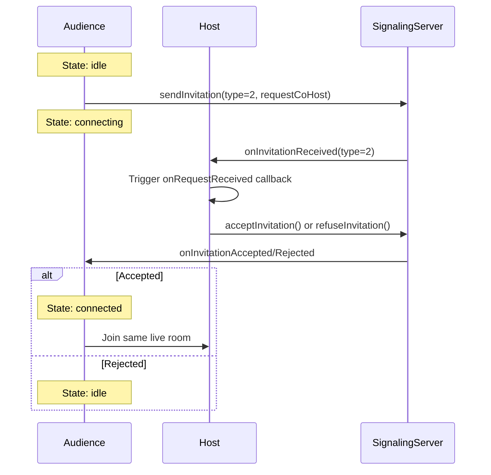
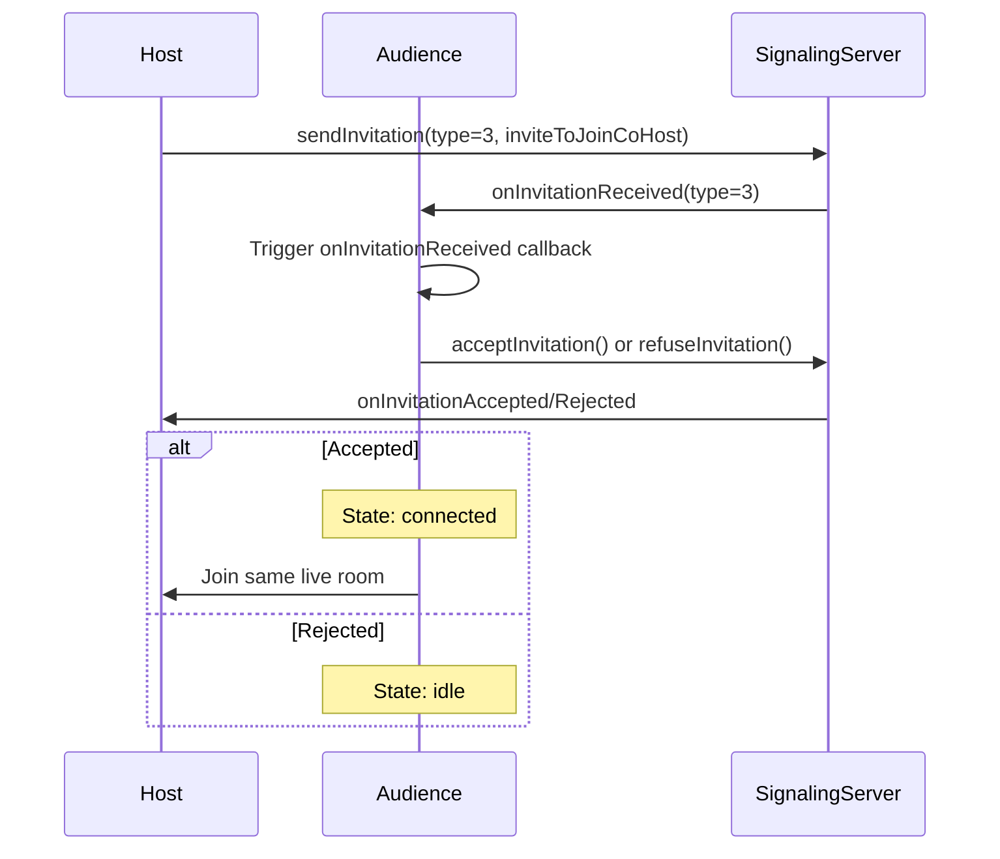
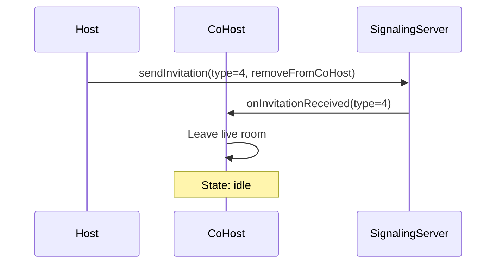
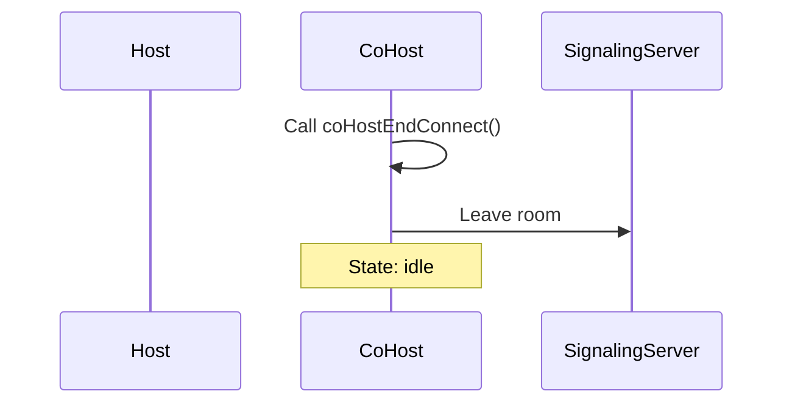

# Co-Hosting (连麦) Protocol Documentation

## Overview

This document describes the Co-Hosting (连麦) protocol used in ZegoUIKitPrebuiltLiveStreaming. Co-Hosting allows audience members to connect with the host and participate in the live stream as video participants.

## Protocol Types

The protocol uses invitation-based signaling with the following invitation types:

| Type | Value | Name | Description |
|------|-------|------|-------------|
| 2 | `requestCoHost` | Audience Request | Audience requests to become a co-host |
| 3 | `inviteToJoinCoHost` | Host Invite | Host invites audience to become co-host |
| 4 | `removeFromCoHost` | Remove Co-Host | Host removes co-host from the stream |
| 6 | `crossRoomPKBattleRequestV2` | PK Request | Cross-room PK battle invitation |

## Data Structures

### PKServiceRequestData

Used for sending co-host/PK requests.

```dart
class PKServiceRequestData {
  final ZegoUIKitUser inviter;      // User initiating the request
  final List<String> invitees;       // List of invitee user IDs
  final String liveID;              // Live room ID
  final bool isAutoAccept;         // Auto-accept flag
  final String customData;          // Custom data payload

  Map<String, dynamic> toJson() => {
    'inviter': inviter,
    'invitees': invitees,
    'live_id': liveID,
    'auto_accept': isAutoAccept,
    'custom_data': customData,
  };
}
```

### PKServiceAcceptData

Used when accepting a co-host/PK invitation.

```dart
class PKServiceAcceptData {
  final String name;    // Invitee's display name
  final String liveID; // Invitee's live room ID

  Map<String, dynamic> toJson() => {
    'name': name,
    'live_id': liveID,
  };
}
```

### PKServiceRejectData

Used when rejecting a co-host/PK invitation.

```dart
class PKServiceRejectData {
  final int code;           // Error code
  final String inviterID;   // ID of the inviter
  final String inviteeName; // Name of the invitee

  Map<String, dynamic> toJson() => {
    'code': code,
    'inviter_id': inviterID,
    'invitee_name': inviteeName,
  };
}
```

## Connection States

Audience members can be in one of the following connection states:

| State | Description |
|-------|-------------|
| `idle` | Default state, not connected |
| `connecting` | Request sent, waiting for host response |
| `connected` | Successfully connected as co-host |

## Interaction Flows

### Flow 1: Audience Requests Co-Hosting



**Steps:**
1. Audience calls `sendInvitation` with type `requestCoHost` (type=2)
2. Host receives the request via `onInvitationReceived` callback
3. Host triggers `events?.coHost.host.onRequestReceived` callback
4. Host decides to accept or refuse
5. If accepted, audience state changes to `connected`; otherwise returns to `idle`

### Flow 2: Host Invites Audience to Co-Host



**Steps:**
1. Host calls `sendInvitation` with type `inviteToJoinCoHost` (type=3)
2. Audience receives the invitation via `onInvitationReceived` callback
3. Audience triggers `events?.coHost.audience.onInvitationReceived` callback
4. Audience decides to accept or refuse
5. If accepted, audience state changes to `connected`; otherwise returns to `idle`

### Flow 3: End Co-Hosting

#### 3a: Host Removes Co-Host



#### 3b: Co-Host Initiates Disconnect



## Event Callbacks

### Host-Side Events

- `events?.coHost.host.onRequestReceived` - Called when audience requests to co-host
- `events?.coHost.host.onRequestAccepted` - Called when host accepts the request
- `events?.coHost.host.onRequestRejected` - Called when host rejects the request

### Audience-Side Events

- `events?.coHost.audience.onInvitationReceived` - Called when host invites to co-host
- `events?.coHost.audience.onInvitationAccepted` - Called when audience accepts
- `events?.coHost.audience.onInvitationRejected` - Called when audience rejects

## Implementation Files

| File | Purpose |
|------|---------|
| `lib/src/core/defines.dart` | Invitation type definitions |
| `lib/src/core/connect_manager.dart` | Core co-host management logic |
| `lib/src/controller/co.host.dart` | Co-host controller implementation |
| `lib/src/modules/pk/core/service/protocol.dart` | Protocol data structures |

## Usage Example

### Audience Request Co-Hosting

```dart
// In co.host.dart controller
ZegoUIKit().getSignalingPlugin().sendInvitation(
  type: ZegoLiveStreamingInvitationType.requestCoHost.value, // type=2
  data: customData,
);
```

### Host Accept Request

```dart
ZegoUIKit().getSignalingPlugin().acceptInvitation(
  invitationID: requestID,
  data: acceptData,
);
```

### Host Remove Co-Host

```dart
ZegoUIKit().getSignalingPlugin().sendInvitation(
  type: ZegoLiveStreamingInvitationType.removeFromCoHost.value, // type=4
  data: customData,
);
```
