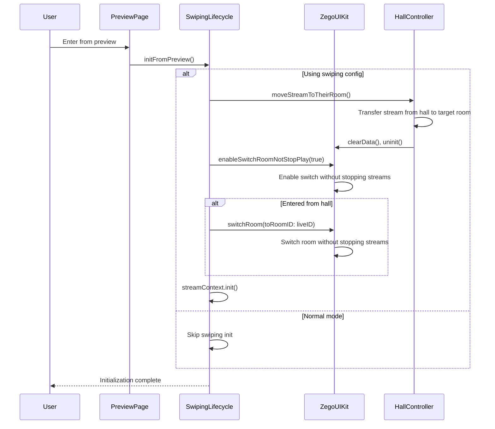
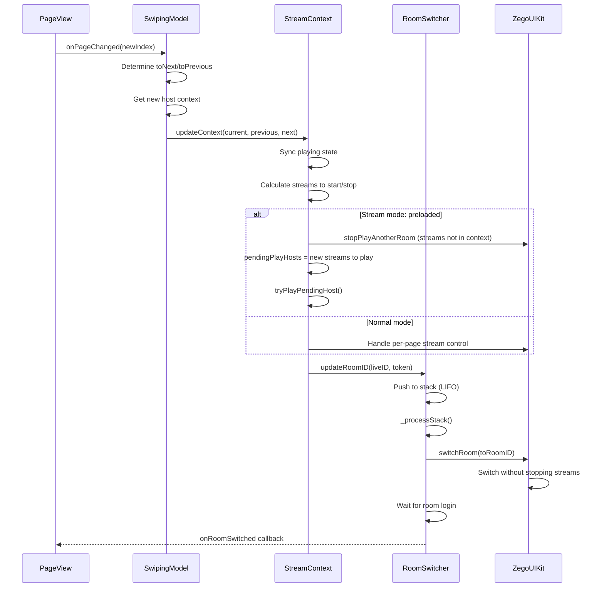
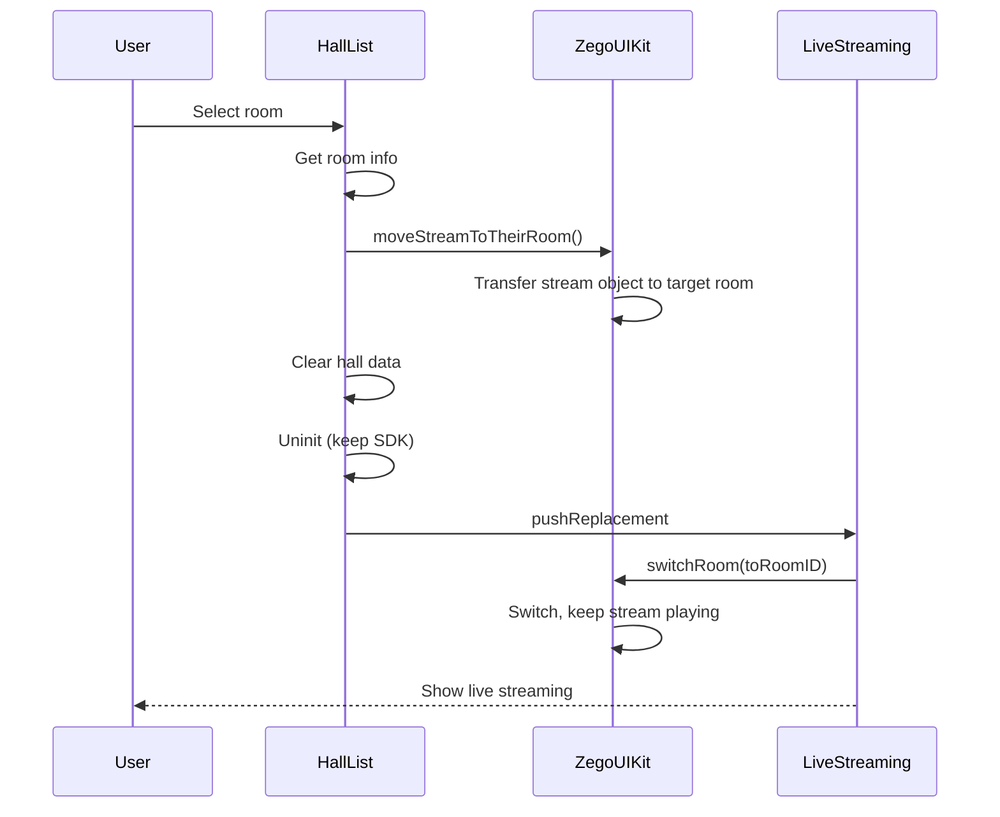

# Live Streaming Swiping Technical Documentation

## Overview

This document describes the swiping feature in ZegoUIKitPrebuiltLiveStreaming, which enables users to swipe up/down to switch between live streaming rooms seamlessly.

## Architecture

### Core Components

| Component                                    | Location                                              | Description                                            |
| -------------------------------------------- | ----------------------------------------------------- | ------------------------------------------------------ |
| `ZegoLiveStreamingSwipingLifeCycle`        | `lib/src/lifecycle/swiping/swiping.dart`            | Manages swiping lifecycle                              |
| `LiveStreamingSwipingStreamContext`        | `lib/src/lifecycle/swiping/stream_context.dart`     | Manages stream context for current/previous/next rooms |
| `ZegoLiveStreamingSwipingPageRoomSwitcher` | `lib/src/lifecycle/swiping/page_room_switcher.dart` | Manages room switching with stack (LIFO)               |
| `ZegoLiveStreamingRoomLoginChecker`        | `lib/src/lifecycle/swiping/room_login_checker.dart` | Checks room login status                               |
| `ZegoLiveStreamingSwipingConfig`           | `lib/src/config.dart`                               | Swiping configuration                                  |

### Entry Points

- **Hall Module**: `lib/src/modules/hall/` - Live streaming hall with room list
- **Swiping Module**: `lib/src/modules/swiping/` - Swiping page implementation
- **Lifecycle**: `lib/src/lifecycle/` - Lifecycle management (normal vs swiping)

## Configuration

### ZegoLiveStreamingSwipingConfig

```dart
class ZegoLiveStreamingSwipingConfig {
  /// Stream mode: preloaded or on-demand
  final ZegoLiveStreamingStreamMode streamMode;

  /// Swiping model - provides live room list
  final ZegoLiveStreamingSwipingModel? model;

  /// Custom model delegate for data management
  final ZegoLiveStreamingSwipingModelDelegate? modelDelegate;
}
```

### Stream Modes

| Mode          | Description                                   |
| ------------- | --------------------------------------------- |
| `preloaded` | Pre-load streams for adjacent rooms (default) |
| `normal`    | Load streams on demand                        |

### Swiping Model

```dart
class ZegoLiveStreamingSwipingModel {
  /// Currently active room
  final ZegoLiveStreamingSwipingHost activeRoom;

  /// Slide context (previous/next rooms)
  final ZegoLiveStreamingSwipingSlideContext activeContext;

  /// Callback to fetch new context when swiping
  final ZegoLiveStreamingSwipingSlideContext Function(bool toNext)? delegate;
}
```

### Host Model

```dart
class ZegoLiveStreamingSwipingHost {
  final String userID;
  final String userName;
  final String liveID;
  final String streamID;
}
```

## Initialization Flow



## Swiping Page Structure

### LoopPageView Implementation

```dart
LoopPageView.builder(
  controller: pageController,
  scrollDirection: Axis.vertical,
  physics: canScroll ? null : NeverScrollableScrollPhysics(),
  onPageChanged: onPageChanged,
  itemCount: 3,  // Fixed: previous, current, next
  itemBuilder: (context, pageIndex) {
    // pageIndex 0 = previous room
    // pageIndex 1 = current room
    // pageIndex 2 = next room
  },
)
```

## Room Switching Flow

### On Page Changed



### Stream Context Update

```dart
Future<void> updateContext({
  required ZegoLiveStreamingSwipingHost currentHost,
  required ZegoLiveStreamingSwipingHost previousHost,
  required ZegoLiveStreamingSwipingHost nextHost,
}) async {
  // 1. Sync playing state
  previousHost.syncPlayingState();
  currentHost.syncPlayingState();
  nextHost.syncPlayingState();

  // 2. Calculate streams to start/stop based on stream mode
  if (streamMode == preloaded) {
    // Start: hosts not yet playing
    // Stop: hosts not in new context
  }

  // 3. Update context
  currentSwipingHost = currentHost;
  previousSwipingHost = previousHost;
  nextSwipingHost = nextHost;

  // 4. Try play pending hosts
  tryPlayPendingHost();
}
```

## Stream Preloading

### How It Works

1. **Pre-load strategy**: Current + Previous + Next (3 rooms)
2. **Cross-room playback**: Use `startPlayAnotherRoomAudioVideo` to play streams from adjacent rooms
3. **Mute management**: Mute streams from non-current rooms

### Key APIs

```dart
// Start playing stream from another room
await ZegoUIKit().startPlayAnotherRoomAudioVideo(
  targetRoomID: currentRoomID,
  anotherRoomID: host.roomID,
  anotherUserID: host.user.id,
  playOnAnotherRoom: true,  // Render in another room's page
);

// Stop playing stream from another room
await ZegoUIKit().stopPlayAnotherRoomAudioVideo(
  targetRoomID: host.roomID,
  host.user.id,
);

// Enable switch without stopping streams
await ZegoUIKit().enableSwitchRoomNotStopPlay(true);
```

## Stack Management

### Why Stack (LIFO)?

When users swipe quickly, multiple room switch requests may be queued. Using LIFO ensures only the latest request is processed.

```dart
// Push new room to stack
_roomStack.add(ZegoLiveStreamingSwipingRoomInfo(
  liveID: liveID,
  token: token,
));

// Process: pop latest, clear others
final targetRoomInfo = _roomStack.removeLast();
_roomStack.clear();  // Clear pending requests
```

## Swiping Control

### Enabling/Disabling Swipe

Swipe is disabled when:

1. Room not fully logged in (Express + Signaling)
2. Audience is in co-hosting state

```dart
_canScrollNotifier.value =
    roomLoginChecker.notifier.value &&
    audienceLocalConnectState != ZegoLiveStreamingAudienceConnectState.connected;
```

## Lifecycle Decoupling

### Problem

Old version coupled page lifecycle with room operations:

- `initState` → `createEngine`, `joinRoom`
- `dispose` → `leaveRoom`, `uninitEngine`

This causes room frequent login/logout during swiping.

### Solution

Using `ZegoLiveStreamingPageLifeCycle`:

```dart
class ZegoLiveStreamingPageLifeCycle {
  final swiping = ZegoLiveStreamingSwipingLifeCycle();
  final normal = ZegoLiveStreamingNormalLifeCycle();

  bool initFromLive({...}) {
    if (swiping.usingRoomSwiping) {
      // Swiping: wait for page builder to drive room switch
      return false;
    } else {
      // Normal: execute normal room join flow
      normal.initStateDelegate.initFromLive(...);
      return true;
    }
  }
}
```

### Normal Flow vs Swiping Flow

| Aspect         | Normal Flow                   | Swiping Flow                          |
| -------------- | ----------------------------- | ------------------------------------- |
| Entry          | `initState` → `joinRoom` | `initFromPreview` → `switchRoom` |
| Exit           | `dispose` → `leaveRoom`  | Unified lifecycle management          |
| Page lifecycle | Coupled with room             | Decoupled from room                   |

## Route Management

Using `pushReplacement` to avoid interfering with app's navigation stack:

```dart
// From hall to live streaming
Navigator.pushReplacement(
  context,
  MaterialPageRoute(
    builder: (context) => ZegoUIKitPrebuiltLiveStreaming(...),
  ),
);

// From live streaming back to hall
Navigator.pushReplacement(
  context,
  MaterialPageRoute(
    builder: (context) => ZegoUIKitLiveStreamingHallList(...),
  ),
);
```

## Hall Integration

### Flow: Hall → Live Streaming



## Data Structures

### Swiping Context

```dart
class LiveStreamingSwipingStreamContext {
  ZegoLiveStreamingSwipingHost currentSwipingHost;
  ZegoLiveStreamingSwipingHost previousSwipingHost;
  ZegoLiveStreamingSwipingHost nextSwipingHost;
  List<ZegoLiveStreamingSwipingHost> pendingPlayHosts;
}
```

### Room Info

```dart
class ZegoLiveStreamingSwipingRoomInfo {
  final String liveID;
  final String token;
}
```

## Key Files Reference

| File                                                  | Purpose                  |
| ----------------------------------------------------- | ------------------------ |
| `lib/src/modules/swiping/swiping.dart`              | Module exports           |
| `lib/src/modules/swiping/defines.dart`              | Type definitions         |
| `lib/src/modules/swiping/style.dart`                | Style configuration      |
| `lib/src/modules/hall/defines.dart`                 | Hall type definitions    |
| `lib/src/modules/hall/list.dart`                    | Hall list implementation |
| `lib/src/lifecycle/swiping/swiping.dart`            | Swiping lifecycle        |
| `lib/src/lifecycle/swiping/stream_context.dart`     | Stream context           |
| `lib/src/lifecycle/swiping/page_room_switcher.dart` | Room switcher            |
| `lib/src/lifecycle/swiping/room_login_checker.dart` | Login checker            |
| `lib/src/config.dart`                               | Configuration classes    |

## Usage Example

### Basic Setup

```dart
ZegoUIKitPrebuiltLiveStreaming(
  appID: yourAppID,
  appSign: yourAppSign,
  userID: userID,
  userName: userName,
  liveID: liveID,
  config: ZegoUIKitPrebuiltLiveStreamingConfig(
    swiping: ZegoLiveStreamingSwipingConfig(
      model: ZegoLiveStreamingSwipingModel(
        activeRoom: ZegoLiveStreamingSwipingHost(
          userID: host1ID,
          userName: host1Name,
          liveID: live1ID,
          streamID: stream1ID,
        ),
        activeContext: ZegoLiveStreamingSwipingSlideContext(
          previous: ZegoLiveStreamingSwipingHost(...),
          next: ZegoLiveStreamingSwipingHost(...),
        ),
      ),
    ),
  ),
);
```

### With Custom Model Delegate

```dart
ZegoLiveStreamingSwipingConfig(
  modelDelegate: ZegoLiveStreamingSwipingModelDelegate(
    activeRoom: initialHost,
    activeContext: initialContext,
    delegate: (bool toNext) {
      // Fetch next/previous room data
      return fetchNewContext(toNext);
    },
  ),
)
```

## Events

### Room Switch Callbacks

- `onRoomWillSwitch(fromLiveID, toLiveID)` - Called before room switch
- `onRoomSwitched(liveID)` - Called after room switch completed

## Limitations

1. **Co-hosting**: Swipe is disabled when audience is in co-hosting state
2. **Room login**: Swipe requires both Express and Signaling (if configured) to be logged in
3. **Quick swipe**: Stack management handles rapid swipes, but excessive speed may cause delays

## Performance Considerations

1. **Stream preloading**: Only preload 3 rooms (current, previous, next)
2. **Memory**: Cross-room streams are muted to reduce audio processing
3. **Texture reuse**: Stream objects can be transferred between rooms without recreation
